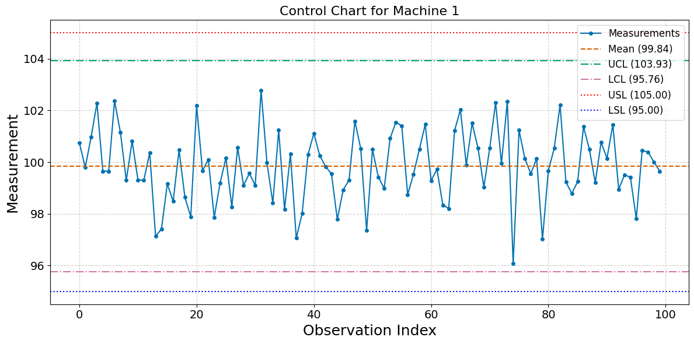
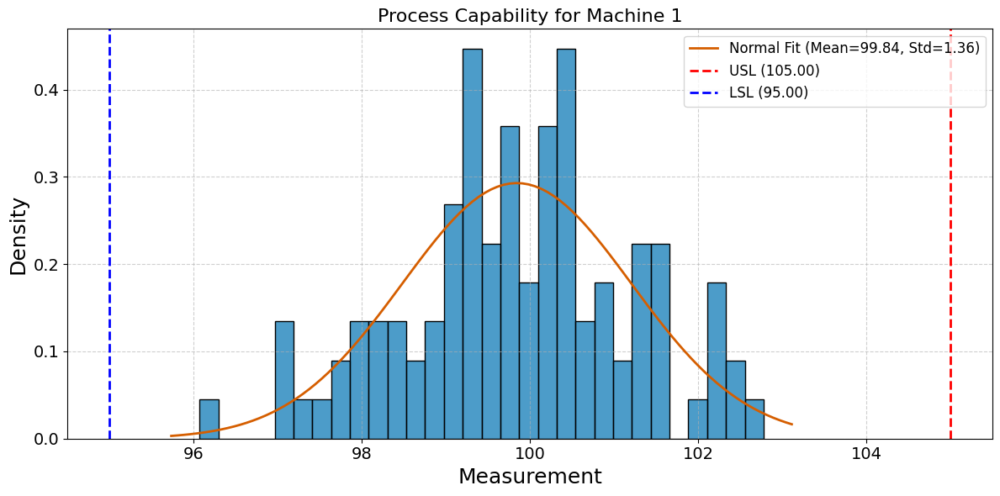
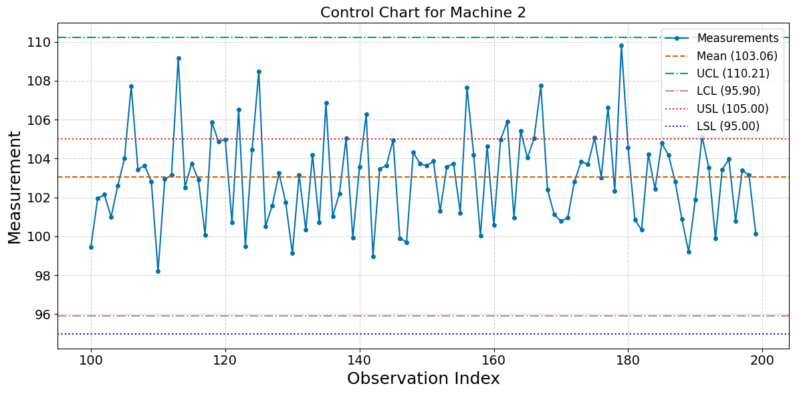
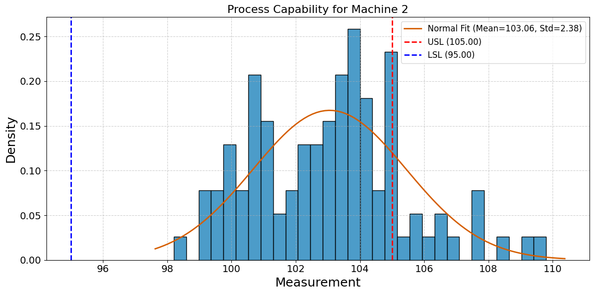
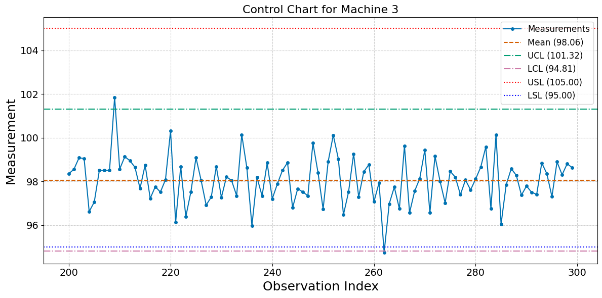
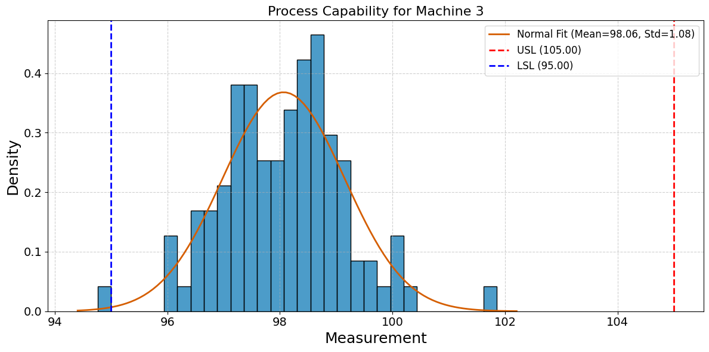
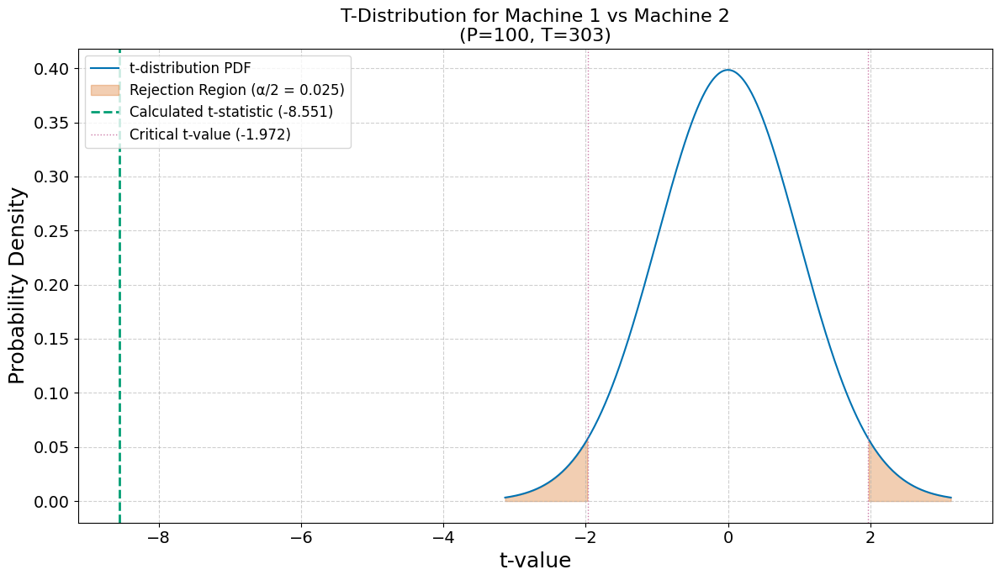
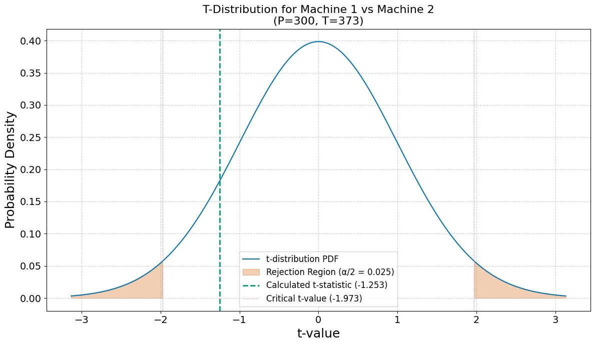

---
title-slide: false
bibliography: references.bib
csl: vancouver.csl
citeproc: true
theme: serif
background-color: "#ffffff"
transition: slide
navigationMode: linear
hash: true
---

:::: {.columns}
::: {.column width="50%"}

## Sample slides
#### PlaceHolderName
#### Universiti Malaysia Perlis
#### [placeholder@email.com](mailto:placeholder@email.com)

<!-- __AUDIO_INTRO_DO_NOT_TOUCH__ -->

:::

::: {.column width="50%"}

:::

::::

---

:::: {.columns}
::: {.column width="50%"}
### Slide one
**Key Concepts:**
- Energy conservation per @carnot1824.
- $\Delta U = Q - W$
:::

::: {.column width="50%"}

:::
::::

---

---

:::: {.columns}
::: {.column width="50%"}
### The Master Equation
The fundamental relation of thermodynamics:

$$\Delta U = Q - W$$

The work done $W$ is positive when the system expands against an external pressure.
:::

::: {.column width="50%"}
<video data-src="media/videos/sample.mp4" data-autoplay loop muted width="100%"></video>
:::
::::

---

:::: {.columns}
::: {.column width="50%"}
### Visualizing the Gas Law
**Interactive Model:**

- P, V, and T relationships.
- Use the slider to adjust pressure.
- Observe the phase boundary.
:::

::: {.column width="50%"}
<iframe 
  data-src="media/plots/sample.html" 
  width="100%" 
  height="500px" 
  style="border:none;" 
  scrolling="no">
</iframe>
:::
::::
---

:::: {.columns}
::: {.column width="50%"}
### Distribution of Math Scores
This histogram visualizes the distribution of 'Math' scores from the `bigclass` dataset.

- **X-axis**: Math Scores
- **Y-axis**: Frequency
- **Binwidth**: 50
:::

::: {.column width="50%"}
<iframe
  data-src='media/plots/math_scores_histogram.html'
  width='100%'
  height='500px'
  style='border:none;'>
</iframe>
:::
::::

---

#### Slide 1: Control chart for Machine 1 (Pressure = 200kPa, Temp = 338K)

:::: {.columns}
::: {.column width="100%"}

:::
::::

---

#### Slide 2: Process capability chart for Machine 1 (Pressure = 200kPa, Temp = 338K)

:::: {.columns}
::: {.column width="100%"}

:::
::::

---

#### Slide 3: Calculate and display the Cpk for Machine 1 (Pressure = 200kPa, Temp = 338K)

:::: {.columns}
::: {.column width="100%"}
Cpk for Machine 1: 1.185
:::
::::

---

#### Slide 4: Text evaluation: Is Machine 1 capable under these conditions?

:::: {.columns}
::: {.column width="100%"}
Conclusion for Machine 1: The process is NOT capable (Cpk = 1.185 < 1.33).
:::
::::

---

#### Slide 5: Control chart for Machine 2 (Pressure = 200kPa, Temp = 338K)

:::: {.columns}
::: {.column width="100%"}

:::
::::

---

#### Slide 6: Process capability chart for Machine 2 (Pressure = 200kPa, Temp = 338K)

:::: {.columns}
::: {.column width="100%"}

:::
::::

---

#### Slide 7: Calculate and display the Cpk for Machine 2 (Pressure = 200kPa, Temp = 338K)

:::: {.columns}
::: {.column width="100%"}
Cpk for Machine 2: 0.272
:::
::::

---

#### Slide 8: Text evaluation: Is Machine 2 capable under these conditions?

:::: {.columns}
::: {.column width="100%"}
Conclusion for Machine 2: The process is NOT capable (Cpk = 0.272 < 1.33).
:::
::::

---

#### Slide 9: Control chart for Machine 3 (Pressure = 200kPa, Temp = 338K)

:::: {.columns}
::: {.column width="100%"}

:::
::::

---

#### Slide 10: Process capability chart for Machine 3 (Pressure = 200kPa, Temp = 338K)

:::: {.columns}
::: {.column width="100%"}

:::
::::

---

#### Slide 11: Calculate and display the Cpk for Machine 3 (Pressure = 200kPa, Temp = 338K)

:::: {.columns}
::: {.column width="100%"}
Cpk for Machine 3: 0.942
:::
::::

---

#### Slide 12: Text evaluation: Is Machine 3 capable under these conditions?

:::: {.columns}
::: {.column width="100%"}
Conclusion for Machine 3: The process is NOT capable (Cpk = 0.942 < 1.33).
:::
::::

---

#### Slide 13: T-Test distribution curve chart showing t-statistic and critical region for Machine 1 vs Machine 2 (P=100, T=303)

:::: {.columns}
::: {.column width="100%"}

:::
::::

---

#### Slide 14: Calculate and display the p-value and t-statistic for the t-test Machine 1 vs Machine 2 (P=100, T=303)

:::: {.columns}
::: {.column width="100%"}
T-statistic (Condition 1): -8.551
P-value (Condition 1): 0.0000
:::
::::

---

#### Slide 15: Text evaluation: Is there a true difference at (P=100, T=303)? (Output: Yes/No based on p-value)

:::: {.columns}
::: {.column width="100%"}
Yes
:::
::::

---

#### Slide 16: T-Test distribution curve chart showing t-statistic and critical region for Machine 1 vs Machine 2 (P=300, T=373)

:::: {.columns}
::: {.column width="100%"}

:::
::::

---

#### Slide 17: Calculate and display the p-value and t-statistic for the t-test Machine 1 vs Machine 2 (P=300, T=373)

:::: {.columns}
::: {.column width="100%"}
T-statistic (Condition 2): -1.253
P-value (Condition 2): 0.2118
:::
::::

---

#### Slide 18: Text evaluation: Is there a true difference at (P=300, T=373)? (Output: Yes/No based on p-value)

:::: {.columns}
::: {.column width="100%"}
No
:::
::::

---

:::: {.columns}
::: {.column width="100%"}
### Overall Conclusion on Machine Capabilities

Based on the Cpk analysis (with USL=105.0, LSL=95.0, Pressure=200, Temperature=338):

*   **Machine 1:** The process is NOT capable (Cpk = 1.185 < 1.33). While close to the acceptable limit, it doesn't meet the standard for capability, suggesting potential for improvement.
*   **Machine 2:** The process is NOT capable (Cpk = 0.272 < 1.33). This machine shows a significantly lower Cpk, indicating a process that is far from capable and requires substantial intervention.
*   **Machine 3:** The process is NOT capable (Cpk = 0.942 < 1.33). Similar to Machine 1, this process does not meet the capability standard and needs improvement efforts.

In summary, none of the machines are currently capable under the specified conditions. Further investigation into the causes of variation and mean shifts is necessary to improve process capability.

:::
::::
